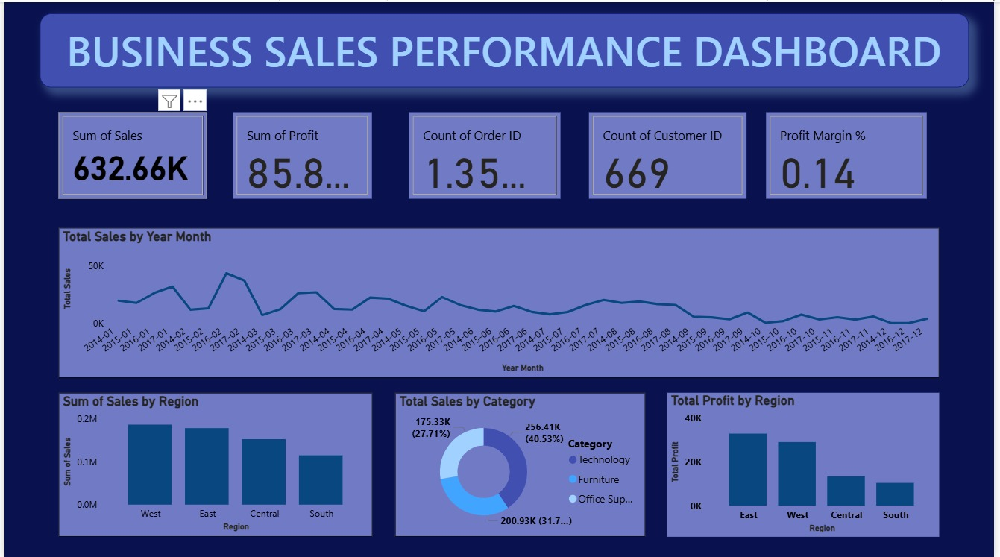
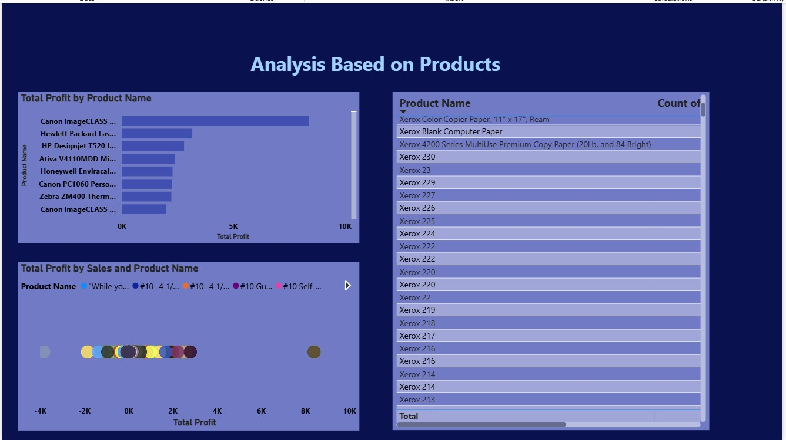
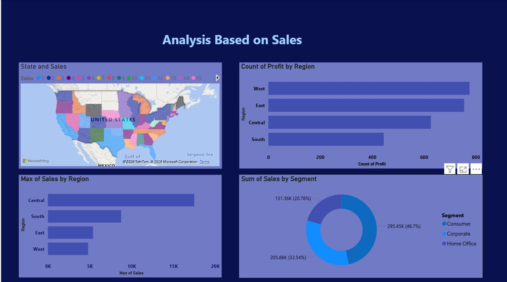

#  Business Sales Performance Dashboard – Power BI

## Project Overview

The **Business Sales Performance Dashboard** is an interactive data visualization project developed using **Microsoft Power BI**. The project analyzes business sales data and presents key performance indicators and insights through interactive dashboards.

The main objective of this project is to transform raw sales data into meaningful visual insights that help understand overall sales performance, profitability, regional performance, product performance, and customer trends.

---

##  Objectives

- Analyze overall business sales and profit performance.
- Track important KPIs such as Total Sales, Total Profit, Order Count, Customer Count, and Profit Margin.
- Analyze sales trends over time.
- Compare sales and profit across different regions.
- Analyze sales performance across product categories and customer segments.
- Identify high-performing products.
- Present business data through clear and interactive Power BI dashboards.

---

## Technologies Used

- **Microsoft Power BI**
- **Power Query**
- **DAX**
- **Data Visualization**
- **Data Analysis**
- **Data Modeling**
- **Excel / CSV Dataset**

---

## 📊 Dashboard 1 – Business Sales Performance Overview

This dashboard provides an overall view of business performance using important KPIs and visualizations.

### Key Metrics

- Total Sales
- Total Profit
- Total Orders
- Total Customers
- Profit Margin

### Analysis Included

- Total Sales by Year and Month
- Sales by Region
- Sales by Product Category
- Profit by Region

The dashboard helps users quickly understand overall business performance and compare sales and profitability across different business dimensions.

---

## 📦 Dashboard 2 – Product-Based Analysis

This dashboard focuses on analyzing the performance of individual products.

### Analysis Included

- Total Profit by Product Name
- Comparison of product profitability
- Product-level sales and profit analysis
- Detailed product listing

This analysis helps identify high-performing and low-performing products and understand their contribution to overall business profitability.

---

## 📈 Dashboard 3 – Sales-Based Analysis

This dashboard provides deeper insights into sales performance across geographical regions and customer segments.

### Analysis Included

- State-wise Sales Analysis
- Profit Analysis by Region
- Maximum Sales by Region
- Sales by Customer Segment

The dashboard helps compare regional performance and understand how different customer segments contribute to overall sales.

---

## Key Insights

The dashboard enables users to:

- Monitor overall sales and profitability.
- Identify regions with strong and weak performance.
- Analyze sales trends over different time periods.
- Compare product categories based on sales.
- Identify profitable products.
- Understand customer segment contributions.
- Support data-driven business decision-making.

---

##  Project Workflow

1. Imported the sales dataset into Power BI.
2. Reviewed and prepared the data for analysis.
3. Performed necessary data transformations using Power Query.
4. Created relationships and prepared the data model.
5. Created required calculations and KPIs.
6. Developed interactive charts and visualizations.
7. Organized the visuals into multiple dashboard views.
8. Analyzed sales, profit, product, regional, and customer segment performance.

---

##  Skills Demonstrated

- Business Intelligence (BI)
- Power BI
- Data Analysis
- Data Visualization
- Dashboard Development
- Data Cleaning and Transformation
- KPI Analysis
- Business Data Interpretation

---

##  Dataset

The project uses the **Sample Superstore** dataset containing business information such as:

- Orders
- Sales
- Profit
- Products
- Categories
- Customer Segments
- Regions
- States

---

##  Future Improvements

The dashboard can be further improved by:

- Adding advanced drill-through analysis.
- Creating additional interactive filters and slicers.
- Adding sales forecasting.
- Implementing advanced DAX measures.
- Integrating the dashboard with regularly updated data sources.
- Publishing the dashboard using Power BI Service for online access.

---

##  Author

**Rajasri Jyothula**

This project was created to demonstrate practical skills in **Business Intelligence, Data Analysis, Data Visualization, and Power BI dashboard development**.
